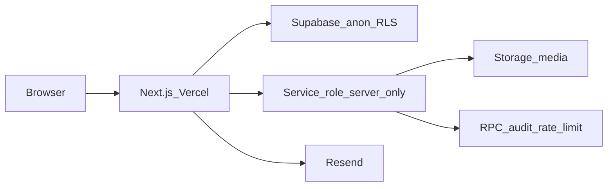

# Arquitectura — LCS Web

## Visión

Aplicación **monolito Next.js** con:

- **Sitio público** SSR/ISR (App Router `(public)`)
- **CMS** por workspaces (`/admin`, `/editor`, `/marketing`, `/viewer`)
- **Supabase** como BaaS: Auth, Postgres + RLS, Storage (`media`)
- **Resend** para correo del formulario de contacto



## Carpetas principales

```
LCS/
├── README.md
├── AGENTS.md
├── docs/                 # Documentación de producto/ops
├── .github/              # CI + PR template
├── .cursor/              # Rules y skills del equipo
└── web/                  # Aplicación Next.js (root de Vercel)
    ├── src/app/(public)/ # Páginas del sitio
    ├── src/app/(admin)/  # CMS admin (+ actions)
    ├── src/app/(editor|marketing|viewer)/
    ├── src/components/   # UI pública + CMS + admin
    ├── src/services/     # Acceso a datos (único punto)
    ├── src/lib/          # auth, seo, security, media, validators
    ├── supabase/         # migrations + seed
    └── scripts/          # apply-hardening, apply-db, etc.
```

## Rutas públicas

| Ruta | Contenido |
|------|-----------|
| `/` | Hero (`home.hero`), pilares, historia, stats, proyectos featured, servicios, clientes |
| `/nosotros` | Cabecera opcional + about_sections + cobertura |
| `/servicios` | Grid `services` |
| `/proyectos` | Listado `projects` |
| `/proyectos/[slug]` | Detalle |
| `/clientes` | Logos `clients` |
| `/certificaciones` | `certifications` |
| `/contacto` | Datos `site_settings` + formulario |

Lectura: `web/src/services/content.ts` → `status = published`, orden `sort_order`. Cache ~60s + tags.

## CMS — módulos

Ver [CMS.md](CMS.md). Render: `web/src/components/cms/render-module.tsx`.

Permisos: `web/src/lib/auth/roles.ts` (`canWriteModule`, `canMutateTable`, `navGroupsForRole`).

## Autenticación

1. Middleware (`web/src/lib/supabase/middleware.ts`):
   - `getUser()` en rutas de workspace.
   - Verificación JWT del access token con `jose` (`web/src/lib/auth/jwt.ts` + `SUPABASE_JWT_SECRET`).
   - Idle 15 min vía cookie `lcs_last_active` (`web/src/lib/auth/idle.ts`).
2. Cliente CMS: `IdleLogout` en `WorkspaceShell` (ping `/api/auth/activity` + logout local).
3. Layouts / `requireWorkspace` / `requireModuleAccess`.
4. Server actions: `requireProfile` + `canMutateTable` + Zod allowlist.
5. RLS Postgres: `can_write_content()` excluye `viewer`.

Login UI: `/admin/login` (split-screen LCS). Sin signup público; forgot password vía API.

## APIs Route Handlers

| Endpoint | Uso |
|----------|-----|
| `POST /api/contact` | Formulario público (Turnstile + rate limit + honeypot + Resend) |
| `POST /api/auth/login` | Login + rate limit + audit + cookie idle |
| `POST /api/auth/logout` | `signOut` + borra idle (`?reason=idle` → audit idle) |
| `POST /api/auth/activity` | Renueva `lcs_last_active` (sesión activa) |
| `POST /api/auth/forgot-password` | Reset email Supabase + rate limit |
| `POST /api/admin/media/upload` | Upload optimizado (Sharp → WebP) |
| Invite usuarios | vía services + service role (solo super_admin) |

## Datos clave

| Tabla | Notas |
|-------|-------|
| `profiles` | `role` enum, `is_active` |
| `banners` | `placement` (slot), singleton published por placement |
| `about_sections` | `key` fija: historia/mision/vision/valores |
| `projects` | `featured` → bloque Inicio |
| `media_assets` | Biblioteca; entidades guardan URL |
| `contact_messages` | Insert solo service role (API) |
| `audit_events` | Append-only vía RPC |
| `seo_meta` | Existe en DB; metadata pública actual vía `lib/seo.ts` |

## Decisiones de diseño

- **No** page builder libre: slots fijos alineados al sitio ([CMS.md](CMS.md)).
- **No** Headless CMS de terceros.
- Service role **nunca** en `NEXT_PUBLIC_*`.
- Fallback seed solo si no hay Supabase o `ALLOW_CONTENT_FALLBACK=true` / no-prod.
